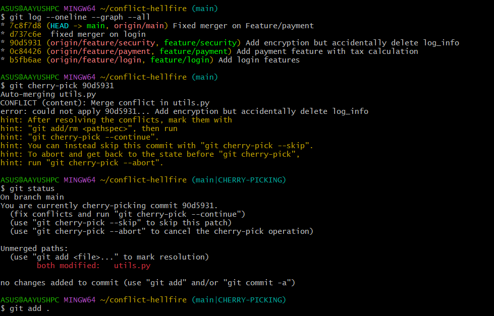
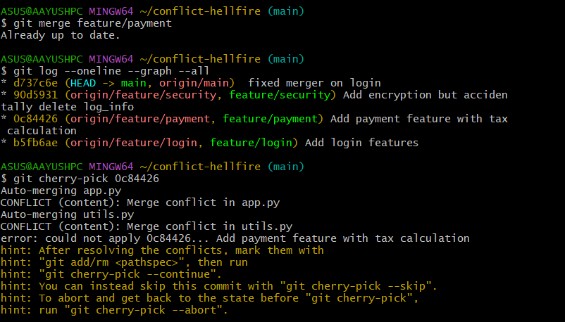
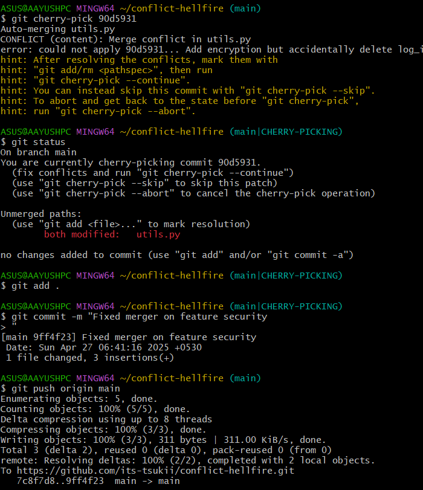

# 🧨 Conflict Hellfire


---

## 🚀 Overview

**Conflict Hellfire** is a Git playground where merge conflicts ran wild and cherry-pick became the hero.  
The repo simulates a real-world situation where multiple features (`login`, `payment`, `security`) were developed in parallel... and chaos ensued. 🔥

I resolved everything **with clean merges**, **smart cherry-picks**, and a sprinkle of **sleep deprivation** (28 hours no sleep gang ✌️).

---

## 📜 Problem Statement

When multiple developers (or branches) work independently, merging them back into the `main` branch can lead to **conflicts**.  
Especially when:
- Same files are modified in different branches.
- Changes overlap or contradict each other.

Here, the goal was:
- Merge three feature branches (`feature/login`, `feature/payment`, `feature/security`) into `main`.
- Handle all conflicts manually and cleanly.
- Use `cherry-pick` when necessary to only pick **specific commits** instead of merging entire branches blindly.

---

## 🐛 How to Reproduce the Chaos

1. Clone the repo:
    ```
    git clone https://github.com/its-tsukii/conflict-hellfire.git
    cd conflict-hellfire
    ```

2. Check out each feature branch:
    ```
    git checkout feature/login
    git checkout feature/payment
    git checkout feature/security
    ```

3. Try merging into `main`:
    ```
    git checkout main
    git merge feature/login
    git merge feature/payment
    git merge feature/security
    ```

4. Face conflicts like a true warrior. ⚔️  
5. Solve the conflicts manually (or rage-quit and start over 😅).

---

## ⚙️ Tech Stack

- **Git** (obviously 😉)
- **VSCode** (for conflict resolution)
- **Patience** (lots of it)

---

## 💀 What Went Wrong?

When trying to merge feature branches directly,  
- Some commits were **out of sync**.
- Direct merges would've either duplicated work or messed up clean history.

🔴 **Issue:**  
Merges were pulling **wrong commits** from feature branches.  

✅ **Solution:**  
Use `git cherry-pick` to **selectively pick** the correct commit from each feature branch into `main`.

Example:
```
git cherry-pick <commit-hash>
```
Then resolve conflicts individually.

📸 Screenshots
Imagine these epic scenes:

🔥 Merge conflicts exploding in app.py and utils.py.


🧹 Clean-up after cherry-picking specific commits.


🎯 Finally pushing a clean and glorious main branch to GitHub.


✍️ Author

👤 Name	🔗 Profile
Aayush Kukade	
<br>[LinkedIn](https://www.linkedin.com/in/aayushkukade/) • [Medium](https://medium.com/@sroy10012001)
<br>[Medium-bLog-for-this-repo...<--](https://medium.com/@sroy10012001/conflict-hellfire-my-git-merge-survival-story-level-1-6b2908e36e8f)
🎯 Final Thoughts
"Git conflicts don't break you,
they forge you into a better developer." 🔥

After all the hellfire 🔥,
the repo is now clean, merged, and battle-tested.
Ready for Level 2: The Git Boss Battle. 🕹️
